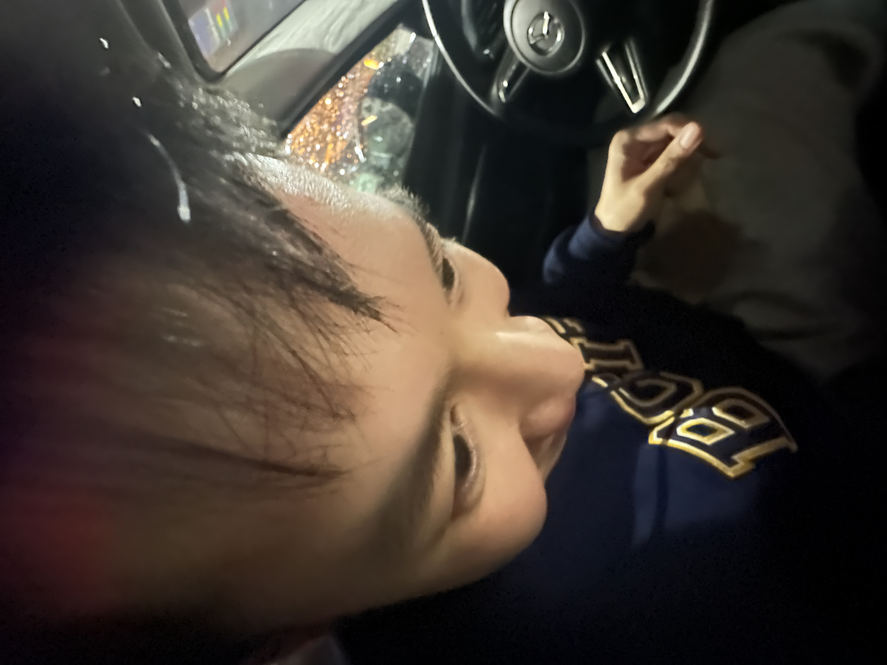
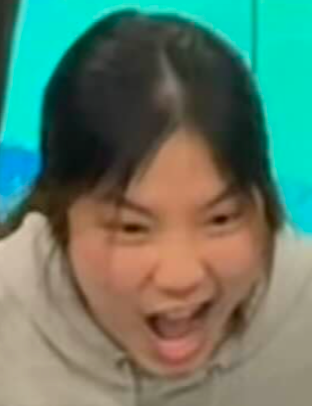
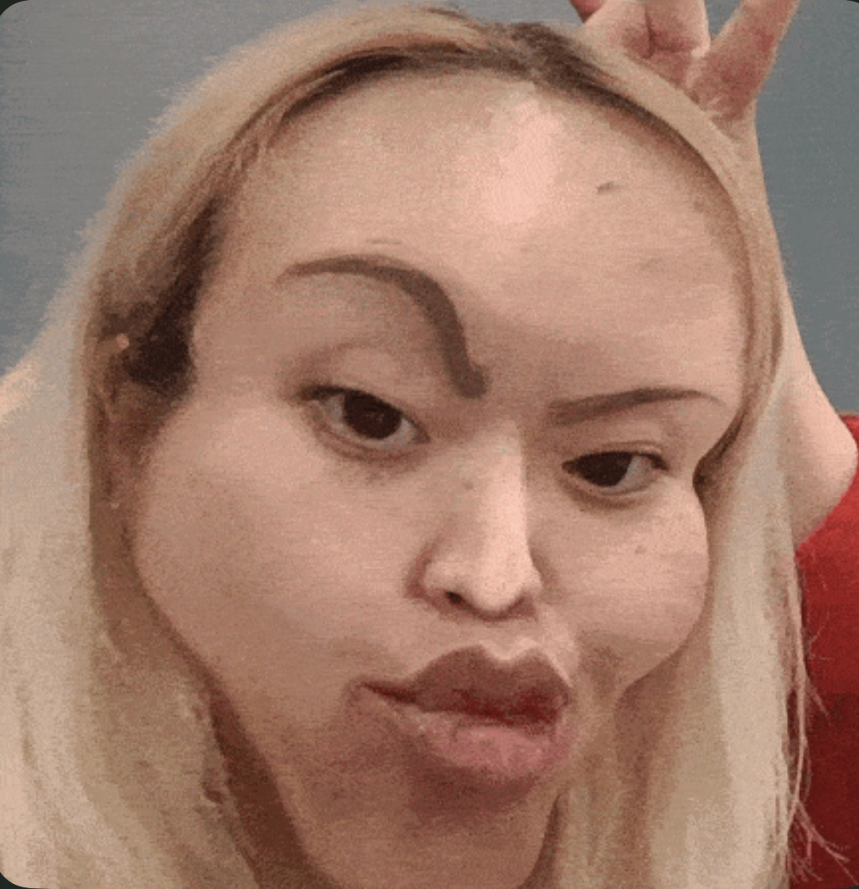
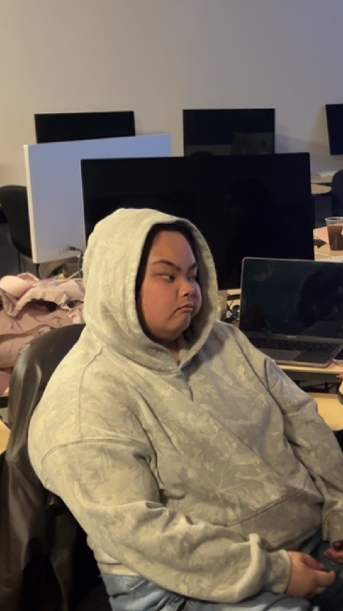
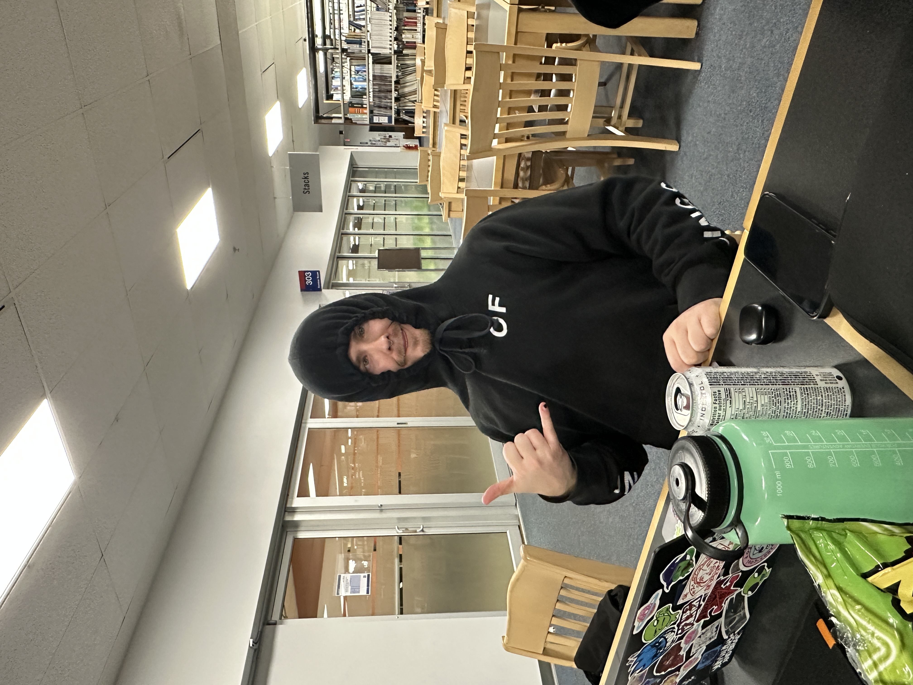
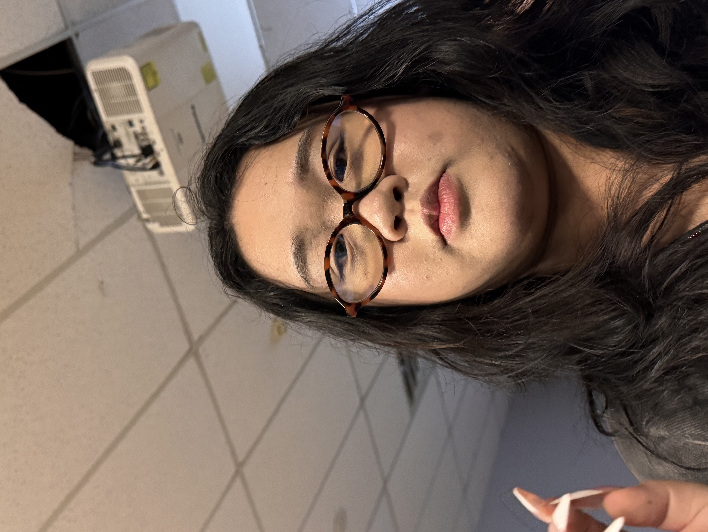
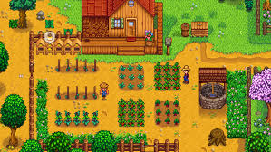

# Lab #4 Assignment - Project Action Plan PR

<!-- Please look at the rubric if you are unsure what the evaluation criteria are for this assignment.

Create a new branch called lab-4 off of main in your personal repository.

In a README.md, using Markdown:

    share what your project is for the semester and who your teammates are

    share what you would like to focus on making perfect in your project

        it should NOT just be completing Project I
        it should NOT be identical to what a teammate is focussing on

    share a brief action plan for implementation (what you need to study up on, and how it relates to your learning plan, if applicable)

Commit your work using sensible commit messages

Push your work to your repository

Open a pull request from lab-4 into main

Submit the url to your pull request
!-->

## Fishtopia Project
### Fishtopia Team Members!
| Name        | Photo |
|-------------|-------|
| Phillip Ho  |  |
| Runn Keerativorant | |
| Tracy Tram    | |
| Nikka Adrias  | |
| Carson Ferguson | |
| Athena Zhu    | |

## About This Game
Fishtopia is a 2D pixel-art fishing simulation game set on a secluded island inhabited by humanoid cat citizens known as the Kittezens. After receiving news of their grandfather’s passing, the player character, Finn, travels to claim an inherited fishing business located on the island.
Upon arrival, a storm wrecks Finn’s boat, leaving them stranded. In order to gain sufficient funds to repair the boat and eventually leave the island, Finn must take over their grandfather’s fishing operation, catch fish, manage the shop, and support the island community.
As the player progresses, they uncover more about their grandfather’s past and begin to question whether leaving the island is truly their final goal.

## What I would like to make perfect in this project
Since my team has no developers and is just designers, I would like to focus more on the design aspect of things. Since we may not be able to develop this game to its fullest potential, I want to put more focus and emphasis on pixel art and making it look pretty. I want to be able to make the landscape of the game look like an actual video game and not just a student project. Since this may be on our portfolio one day, I want to be able to use this to showcase my skills for my future employers in the near future. Below is an example of what I want it to look like. Sidenote, since we are learning so much currently in Project 1 like Wordpress, buying domains, etc. I think this is such a valuable time right now to take in all of the knowledge that Wim has to offer and apply it. 

## What I need to study on
Right now, I need to study on a lot of things. There is a lot to take in these last few weeks. Communication is super important and I am starting to understand it right now. I think people tend to get carried away with their own assignments and personal life that they forget to do the group work and just let the other teammates take care of it. That's why I feel like it's good to communicate with one another so that we can keep each other accountable not just in the real world but also in these multiple group projects we've been working on.

